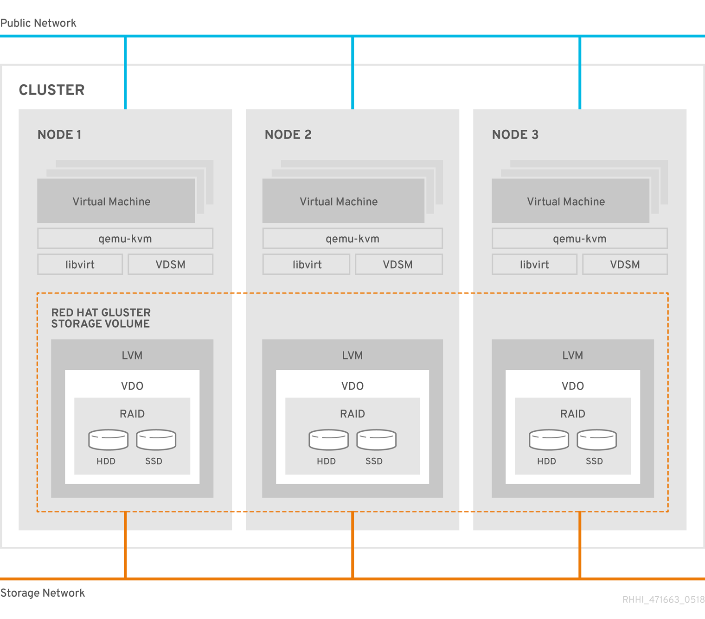

# Chapter 1: Architecture

Red Hat Hyperconverged Infrastructure for Virtualization (RHHI for Virtualization) combines compute, storage, networking, and management capabilities in one deployment.

RHHI for Virtualization is deployed across three physical machines to create a discrete cluster or *pod* using Red Hat Gluster Storage 3.4 and Red Hat Virtualization 4.2.

The dominant use case for this deployment is in remote office branch office (ROBO) environments, where a remote office synchronizes data to a central data center on a regular basis, but does not require connectivity to the central data center to function.

The following diagram shows the basic architecture of a single cluster.

## Understanding VDO

As of Red Hat Hyperconverged Infrastructure for Virtualization 1.5, you can configure a Virtual Data Optimizer (VDO) layer to provide data reduction and deduplication for your storage.

VDO is supported only when enabled on new installations at deployment time, and cannot be enabled on deployments upgraded from earlier versions of RHHI for Virtualization.

Additionally, thin provisioning is not currently compatible with VDO. These two technologies are not supported on the same device.

VDO performs following types of data reduction to reduce the space required by data.

**Deduplication**
: Eliminates zero and duplicate data blocks. VDO finds duplicated data using the UDS (Universal Deduplication Service) Kernel Module. Instead of writing the duplicated data, VDO records it as a reference to the original block. The logical block address is mapped to the physical block address by VDO.

**Compression**
: Reduces the size of the data by packing non-duplicate blocks together into fixed length (4 KB) blocks before writing to disk. This helps to speed up the performance for reading data from storage.

At best, data can be reduced to 15% of its original size.

Because reducing data has additional processing costs, enabling compression and deduplication reduces write performance. As a result, VDO is not recommended for performance sensitive workloads. Red Hat strongly recommends that you test and verify that your workload achieves the required level of performance with VDO enabled before deploying VDO in production.
