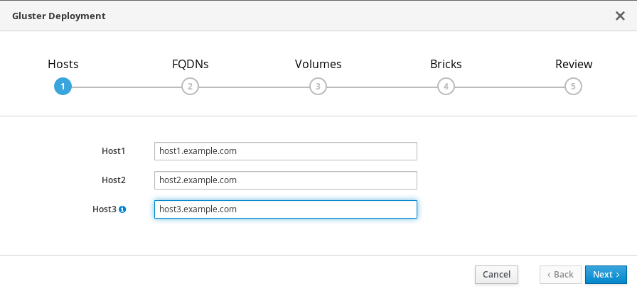

# Configure Red Hat Gluster Storage for Hosted Engine using the Cockpit UI

**IMPORTANT:** Ensure that disks specified as part of this deployment process do not have any partitions or labels.

1. **Log into the Cockpit UI**

   Browse to the Cockpit management interface of the first virtualization host, for example, **https://node1.example.com:9090/**, and log in with the credentials you created in [Install Host Physical Machines](install-host-physical-machines).

2. **Start the deployment wizard**

   1. Click **Virtualization** -> **Hosted Engine** and click **Start** underneath **Hyperconverged**.

      

      The *Gluster Configuration* window opens.

   2. Click the *Run Gluster Wizard* button.

      

      The *Gluster Deployment* window opens in 3 node mode.

3. **Specify storage hosts**

   Specify the back-end FQDNs on the storage network (not the management network) of the three virtualization hosts. The virtualization host that can SSH using key pairs should be listed first, as it is the host that will run gdeploy and the hosted engine.

   **NOTE:** If you plan to create an arbitrated replicated volume, ensure that you specify the host with the arbiter brick as *Host3* on this screen.

   

   Click **Next**.

4. **Specify additional hosts**

   For multi-node deployments, add the fully qualified domain names or IP addresses of the other two virtualization hosts to have them automatically added to Red Hat Virtualization Manager when deployment is complete.

   

   **NOTE:** If you do not add additional hosts now, you can also add them after deployment using Red Hat Virtualization Administration Portal, as described in [Add additional virtualization hosts to the hosted engine](https://access.redhat.com/documentation/en-us/red_hat_hyperconverged_infrastructure_for_virtualization/1.5/html-single/deploying_red_hat_hyperconverged_infrastructure_for_virtualization/index#configure-gluster-rhv-manager-add_hosts).

5. **Specify volumes**

   Specify the volumes to create.

   

   **Name**
   : Specify the name of the volume to be created.

   **Volume Type**
   : Specify a **Replicate** volume type. Only replicated volumes are supported for this release.

   **Arbiter**
   : Specify whether to create the volume with an arbiter brick. If this box is checked, the third disk stores only metadata.

   **Brick Dirs**
   : The directory that contains this volume's bricks.

   The default values are correct for most installations.

6. **Specify bricks**

   Enter details of the bricks to be created. Use the *Select host* drop-down menu to change the host being configured.

   

   **RAID**
   : Specify the RAID configuration to use. This should match the RAID configuration of your host. Supported values are **raid5**, **raid6**, and **jbod**. Setting this option ensures that your storage is correctly tuned for your RAID configuration.

   **Stripe Size**
   : Specify the RAID stripe size in KB. Do not enter units, only the number. This can be ignored for **jbod** configurations.

   **Disk Count**
   : Specify the number of data disks in a RAID volume. This can be ignored for **jbod** configurations.

   **LV Name**
   : Specify the name of the logical volume to be created.

   **Device**
   : Specify the raw device you want to use. Red Hat recommends an unpartitioned device.

   **Size**
   : Specify the size of the logical volume to create in GB. Do not enter units, only the number. This number should be the same for all bricks in a replicated set. Arbiter bricks can be smaller than other bricks in their replication set.

   **Mount Point**
   : Specify the mount point for the logical volume. This should be inside the brick directory that you specified on the previous page of the wizard.

   **Thinp**
   : Specify whether to provision the volume thinly or not. Note that thick provisioning is recommended for the **engine** volume. Do not use **Enable Dedupe & Compression** at the same time as this option.

   **Enable Dedupe & Compression**
   : Specify whether to provision the volume using VDO for compression and deduplication at deployment time. Do not use **Thinp** at the same time as this option.

   **Logical Size (GB)**
   : Specify the logical size of the VDO volume. This can be up to 10 times the size of the physical volume, with an absolute maximum logical size of 4 PB.

7. **Review and edit configuration**

   

   1. Click **Edit** to begin editing the generated deployment configuration file.

   2. (Optional) Configure Transport Layer Security (TLS/SSL)

      This can be configured during or after deployment. If you want to configure TLS/SSL encryption as part of deployment, see one of the following sections:

      * [Configuring TLS/SSL during deployment using a Certificate Authority signed certificate](configure-ssl-tls-during-deployment#configure-ssl-tls-ca-gdeploy)
      * [Configuring TLS/SSL encryption during deployment using a self signed certificate](configure-ssl-tls-during-deployment#configure-ssl-tls-self-gdeploy)

   3. **Review the configuration file**

      If the configuration details are correct, click **Save** and then click **Deploy**.

8. **Wait for deployment to complete**

   You can watch the deployment process in the text field as the gdeploy process runs using the generated configuration file.

   The window displays **Successfully deployed gluster** when complete.

   

   Click **Continue to Hosted Engine Deployment** and continue the deployment process with the instructions in [Deploy the Hosted Engine using the Cockpit UI](deploy-he-cockpit).

**IMPORTANT:** If deployment fails, click the *Redeploy* button. This returns you to the _Review and edit configuration_ tab so that you can correct any issues in the generated configuration file before reattempting deployment.

It may be necessary to clean up previous deployment attempts before you try again. Follow the steps in [Cleaning up automated Red Hat Gluster Storage deployment errors](cleanup-gluster-cockpit-deploy) to clean up previous deployment attempts.
