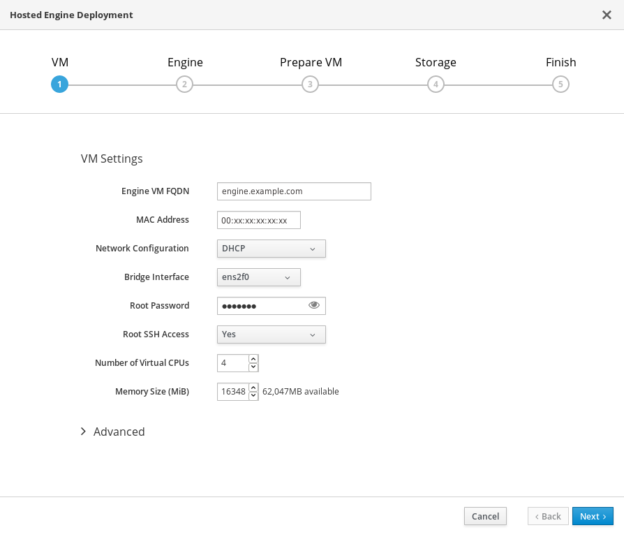
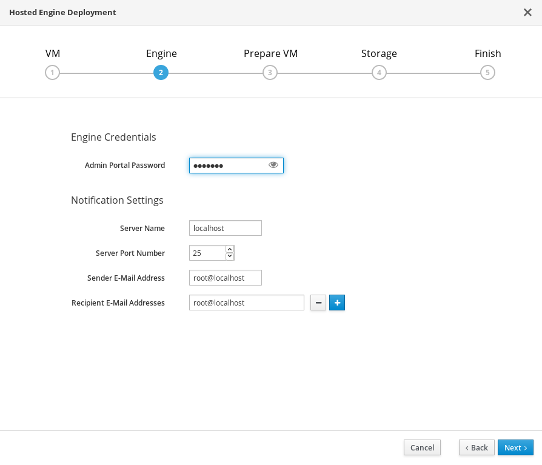
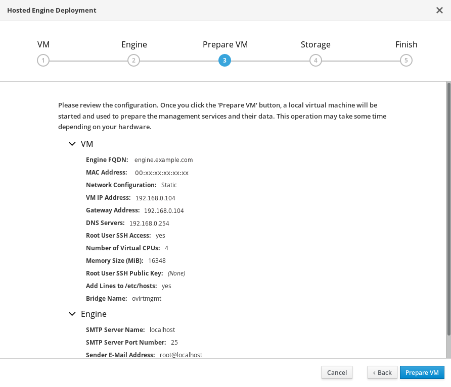
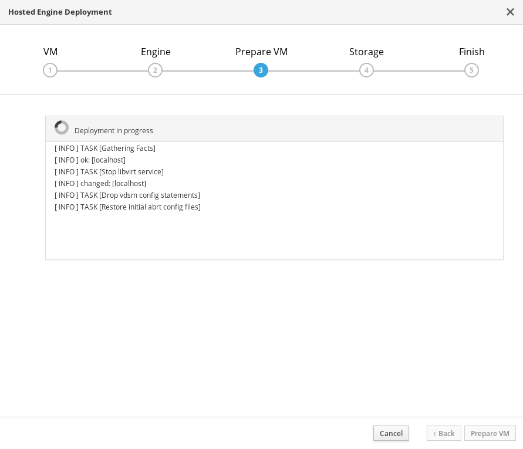
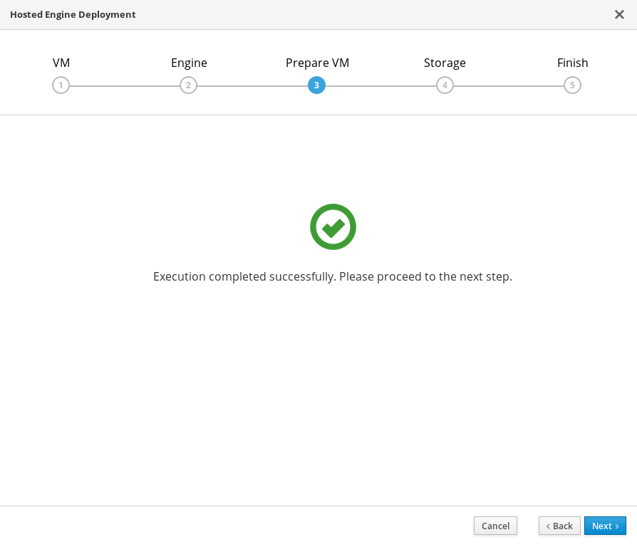
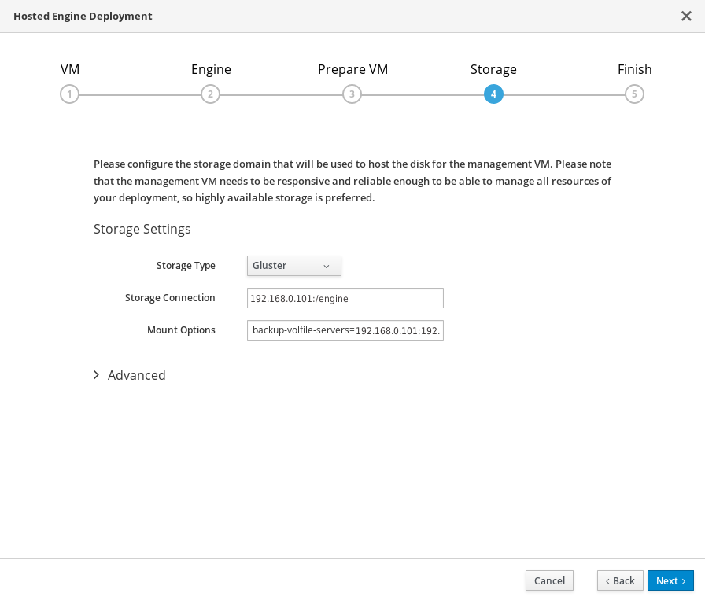
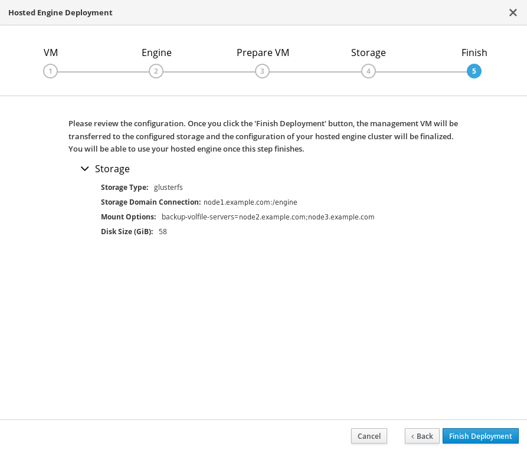
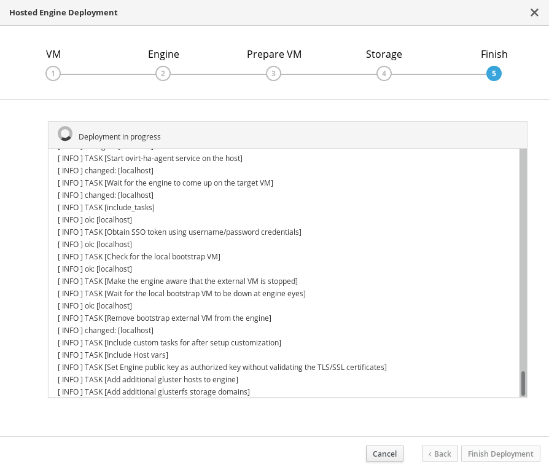
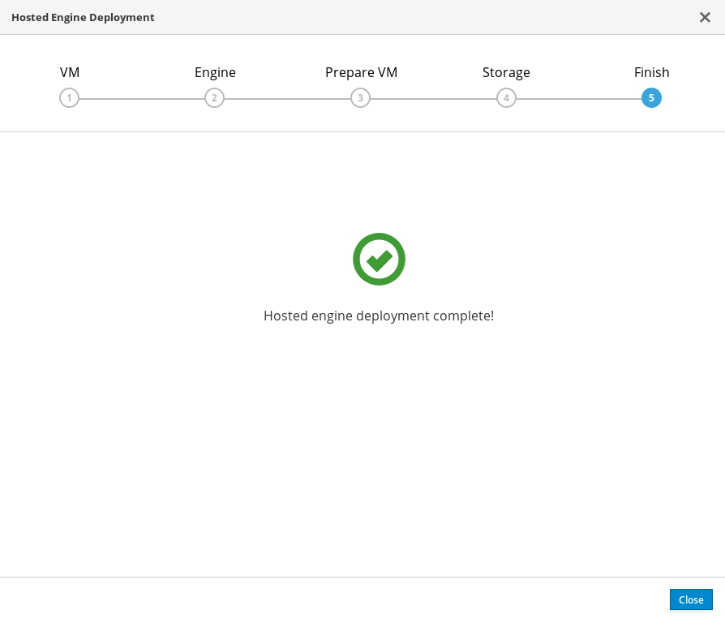
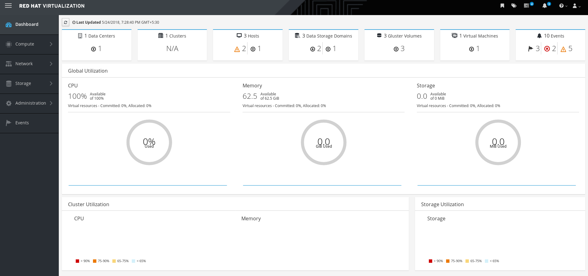

# Deploy the Hosted Engine using the Cockpit UI

This section shows you how to deploy the Hosted Engine using the Cockpit UI. Following this process results in Red Hat Virtualization Manager running as a virtual machine on the first physical machine in your deployment. It also configures a Default cluster comprised of the three physical machines, and enables Red Hat Gluster Storage functionality and the **virtual-host** *tuned* performance profile for each machine in the cluster.

**Prerequisites**
* This procedure assumes that you have continued directly from the end of [Configure Red Hat Gluster Storage for Hosted Engine using the Cockpit UI](https://access.redhat.com/documentation/en-us/red_hat_hyperconverged_infrastructure_for_virtualization/1.5/html-single/deploying_red_hat_hyperconverged_infrastructure_for_virtualization/#task-config-rhgs-using-cockpit).
* Gather the information you need for Hosted Engine deployment

  Have the following information ready before you start the deployment process.

  * IP address for a pingable gateway to the virtualization host
  * IP address of the front-end management network
  * Fully-qualified domain name (FQDN) for the Hosted Engine virtual machine
  * MAC address that resolves to the static FQDN and IP address of the Hosted Engine

**Procedure**

1. **Specify virtual machine details**

   

   1. Enter the following details:

      **Engine VM FQDN**
      : The fully qualified domain name to be used for the Hosted Engine virtual machine.

      **MAC Address**
      : The MAC address associated with the FQDN to be used for the Hosted Engine virtual machine.

      **Root password**
      : The root password to be used for the Hosted Engine virtual machine.

   2. Click **Next**.

2. **Specify virtualization management details**

   1. Enter the password to be used by the `admin` account in Red Hat Virtualization Manager. You can also specify notification behaviour here.

      

   2. Click **Next**.

3. **Review virtual machine configuration**

   1. Ensure that the details listed on this tab are correct. Click **Back** to correct any incorrect information.

      

   2. Click **Prepare VM**.

      

   3. Wait for virtual machine preparation to complete.

      

      If preparation does not occur successfully, see [Viewing Hosted Engine deployment errors](https://access.redhat.com/documentation/en-us/red_hat_hyperconverged_infrastructure_for_virtualization/1.5/html-single/deploying_red_hat_hyperconverged_infrastructure_for_virtualization/#tshoot-he-deploy-error).

   4. Click **Next**.

4. **Specify storage for the Hosted Engine virtual machine**

   1. Specify the primary host and the location of the `engine` volume, and ensure that the `backup-volfile-servers` values listed in **Mount Options** are the IP addresses of the additional virtualization hosts.

      

   2. Click **Next**.

5. **Finalize Hosted Engine deployment**

   1. Review your deployment details and verify that they are correct.

      **NOTE:** The responses you provided during configuration are saved to an answer file to help you reinstall the hosted engine if necessary. The answer file is created at `/etc/ovirt-hosted-engine/answers.conf` by default. This file should not be modified manually without assistance from Red Hat Support.

      

   2. Click **Finish Deployment**.

6. **Wait for deployment to complete**

   This takes up to 30 minutes.

   

   The window displays the following when complete.

   

   **IMPORTANT:** If deployment does not complete successfully, see [Viewing Hosted Engine deployment errors](https://access.redhat.com/documentation/en-us/red_hat_hyperconverged_infrastructure_for_virtualization/1.5/html-single/deploying_red_hat_hyperconverged_infrastructure_for_virtualization/#tshoot-he-deploy-error).

   Click **Close**.

7. **Verify hosted engine deployment**

   Browse to the engine user interface (for example, http://engine.example.com/ovirt-engine) and verify that you can log in using the administrative credentials you configured earlier. Click **Dashboard** and look for your hosts, storage domains, and virtual machines.

   

**Next steps**
* [Log in to Red Hat Virtualization Manager to complete configuration](https://access.redhat.com/documentation/en-us/red_hat_hyperconverged_infrastructure_for_virtualization/1.5/html-single/deploying_red_hat_hyperconverged_infrastructure_for_virtualization/#configure-gluster-rhv-manager).
