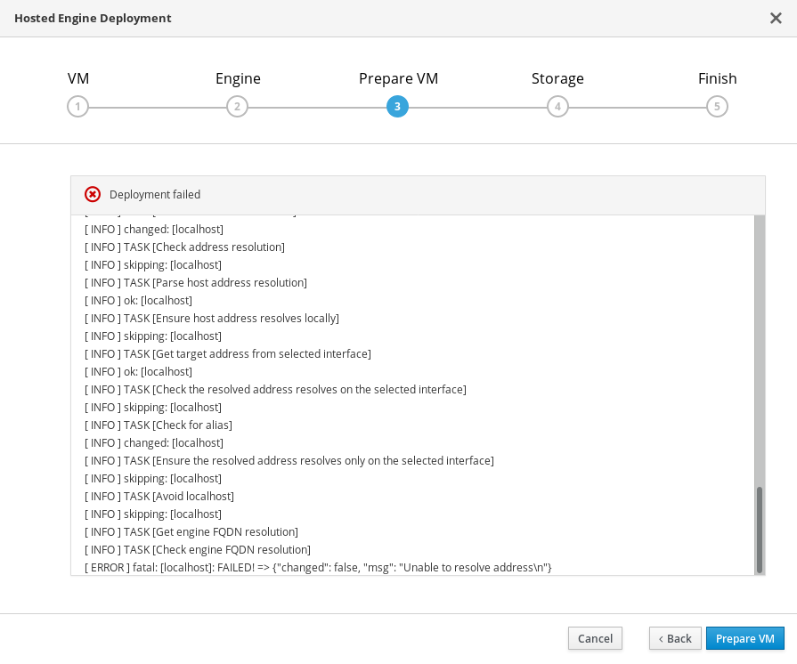
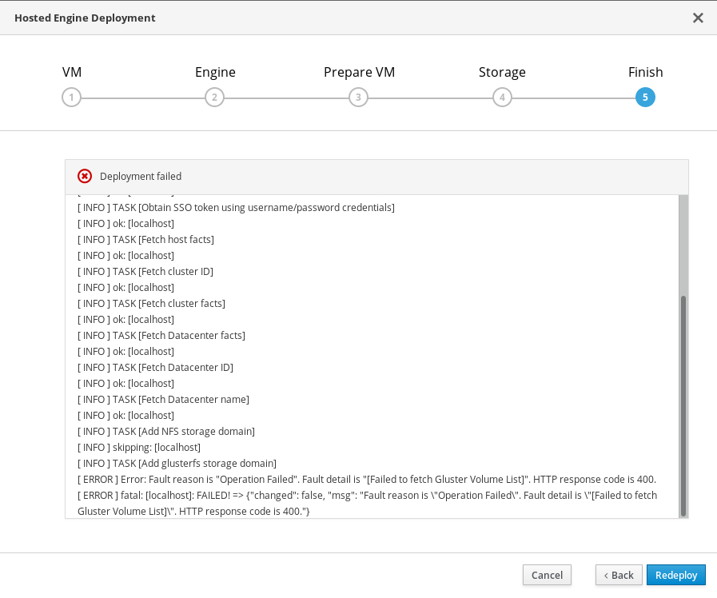

# Viewing Hosted Engine deployment errors

## Failed to prepare virtual machine

If an error occurs while preparing the virtual machine, deployment pauses, and you see a screen similar to the following:

**Preparing virtual machine failed**

Review the output, and click **Back** to correct any entered values and try again.

Contact Red Hat Support with details of errors for assistance in correcting them.

## Failed to deploy hosted engine

If an error occurs during hosted engine deployment, deployment pauses, and you see a screen similar to the following:

**Hosted engine deployment failed**

Review the output for error information.

Click **Back** to correct any entered values and try again.

If deployment failed after the physical volume or volume group were created, you must also follow the steps in [Cleaning up automated Red Hat Gluster Storage deployment errors](cleanup-gluster-cockpit-deploy) to return your system to a fresh state for the deployment process.

If you need help resolving errors, contact Red Hat Support with details.
