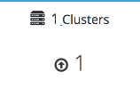

# Verify your deployment

After deployment is complete, verify that your deployment has completed successfully.

1. Browse to the engine user interface, for example, `http://engine.example.com/ovirt-engine`.

   **Administration Console Login**

   

2. Log in using the administrative credentials added during hosted engine deployment.

   When login is successful, the Dashboard appears.

   **Administration Console Dashboard**

   

3. Verify that your cluster is available.

   **Administration Console Dashboard - Clusters**

   

4. Verify that at least one host is available.

   If you provided additional host details during Hosted Engine deployment, 3 hosts are visible here, as shown.

   **Administration Console Dashboard - Hosts**

   

   1. Click **Compute** -> **Hosts**.

   2. Verify that all hosts are listed with a **Status** of `Up`.

      **Administration Console - Hosts**

      

5. Verify that all storage domains are available.

   1. Click **Storage** -> **Domains**.

   2. Verify that the `Active` icon is shown in the first column.

      **Administration Console - Storage Domains**

      
